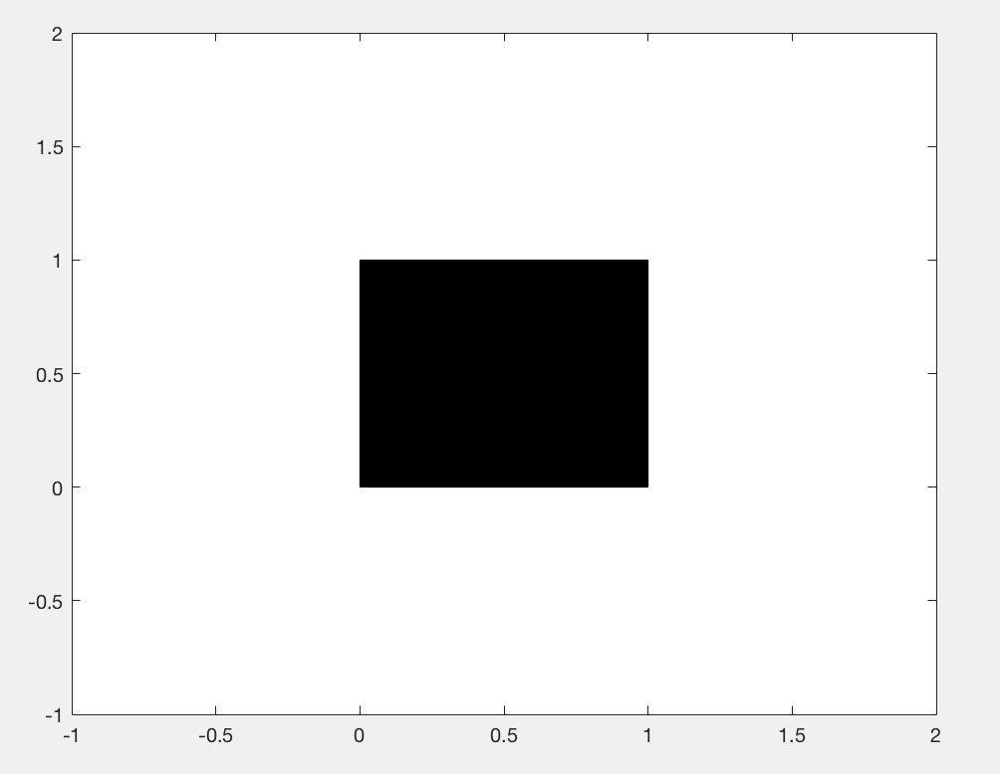

Recently, I was working on plotting some time series for a model with 6 variables. I wanted to visualize the solutions for this process as a mean model solution +/- one standard deviation, with a semi-transparent fill between the standard deviations and had a little trouble remembering how to do this. 

MATLAB's documentation tells you that the `fill` function makes polygons, with the vertices specified by the x and y values you supply. 


```{#mycode .matlab .numberLines startFrom="1"}
x = [0 0 1 1] % x values of vertices
y = [0 1 1 0] % y values of vertices 
fill(x,y,'k')
```

<p align="center">

</p>





The order of the vertices matters - so while the above makes a rectangle, if the last entries of `y` are switched, you get a bowtie instead of a rectangle, 


x = [0 0 1 1] %  x values of vertices
y = [0 1 0 1] %  y values of vertices
fill(x,y,'k')

<p align="center">

</p>
Notice that `fill` automatically closes the polygon by drawing a line from the last specified vertex to the initial vertex. In the case of the bowtie, from `(1,1)` to `(0,0)`. 

To draw time series data with those crafty standard deviation shadings, we can draw a polygon that goes "out and back".  The x values should monotonically increase, and then turn around and monotonically decrease in the same way. The trick in MATLAB is to use the 
`flip` function, which reverses a vector. 


>>> t = [1 2 3 5 8 10];
>>> full_tvec = [t flip(t)]

full_tvec =

     1     2     3     5     8    10    10     8     5     3     2     1


Very out and back. 

Suppose we have a data matrix where the rows are different time points and the columns are different observations of the variable at those time points.  
From this data, I can compute the mean and standard deviation at each time point. 
Finally, the `fill` function can be used to plot the time series, where the top vertices are the mean +1 standard deviation and the bottom vertices are the mean -1 standard deviation. 



% Generate data
t = 1:100;
data = randn(100,5);
data_mean = mean(data,2)';
stdv = std(data,[],2)';

% Plotting
hold on
h = fill([t flip(t)],[data_mean+stdv flip(data_mean-stdv)],'k');
set(h,'facealpha',.5)
plot(t,data_mean,'k')
xlabel('Time','Fontsize',20)


<p align="center">

</p>
